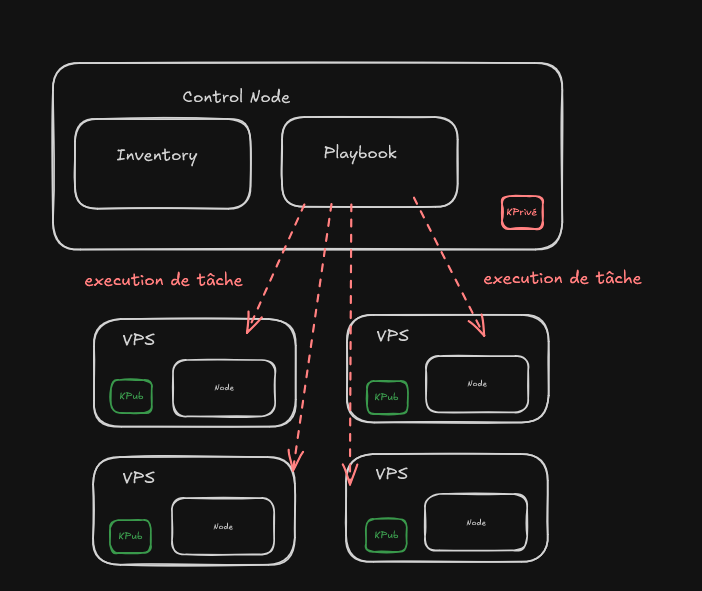
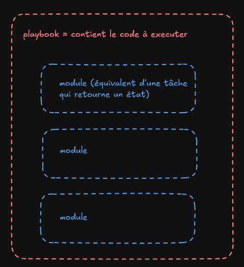

---
# Feel free to add content and custom Front Matter to this file.
# To modify the layout, see https://jekyllrb.com/docs/themes/#overriding-theme-defaults

layout: default
---


# Documentation Ansible

## Préambule

Connexion SSH établie entre les machines Host (VPS) et le machine qui executera le playbook
Utiliser la commande suivante pour la génération de paire de clef : 

```shell
ssh-keygen -t ed25519 -f ansible -C ansible -p ''
```

## Principe de fonctionnement





## Préparation de la machine Host (VPS)

- Créer un user linux sur le VPS : hopper (sans les droits sudo)

```shell
sudo adduser hopper
```

- Donner les droits sur la commande Docker

```shell
sudo usermod -aG docker hopper
```

- Créer le fichier authorized_keys (Contient les clef pub)

```shell
touch ~/.ssh/authorized_keys
```

- Insérer la clef public avec l'éditeur nano ou vim pour les anciens (Seigneurs ou Serviteurs)

```shell
ssh-ed25519 AAAAC3NzaC1lZDI1NTE5AAAAILr/M0oxN87qdLh+Q2B5kUl9o/N3PARd+zoK5tmlVkhM ponche@DESKTOP-JC1EUSK
```

- Donner votre ip/domaine de votre VPS à notre seigneur Rémi le tout Puissant. Afin qu'il puisse le mettre dans "inventory" tout en s'exclamant "Non de Zeus!!!"

- S'assurer qu'aucun parfeu ne bloque le port 22 (par défaut). Si port changé, le communiquer à notre seigneur Rémi.

- Félicitation vous venez d'achever la phase préparatif, et n'oubliez pas de remercier notre Seigneur Rémi, sinon gard à vous!!!


## Informations concernant inventory

Explication du fichier inventory.ini :

```ini
[vpskapoot] (Nom du groupe)

vps1.example.com
(nomDomaine)

ipAddress ansible_port=6969
(124.124.2.1 ansible_port=22)


[vpskapoot:vars]
ansible_ssh_common_args='-o StrictHostKeyChecking=no'
ansible_user=hopper
ansible_ssh_private_key_file=~/hopper/key-hopper/id_hopper
```

NB: Les informations englobés entre paranthèses sont à titre indicatif

## Information concernant playbook (ansible/updateSiteKapoot.yml)

```yml
- name: Update the application kapoot
  hosts: vpskapoot
  tasks:
   - name: Ping my hosts ( Test de ping pour vérifier la connexion )
     ansible.builtin.ping:

   - name: copy compose.yml ( copie le fichier compose.yaml qui contient la definition du reseau docker de l'app sur l'emplacement ~/kapoot des VPS )
     ansible.builtin.copy: 
      dest: ~/kapoot/
      force: true
      src: data/compose.yml

   - name: copy .env ( copie le .env de l'app sur l'emplacement ~/kapoot des VPS )
     ansible.builtin.copy:
      dest: ~/kapoot/
      force: false
      src: data/.env

   - name: pull the new image and update the docker network
     community.docker.docker_compose_v2:
      project_src: kapoot
      pull: always
```

NB: Les informations englobés entre paranthèses sont à titre indicatif

## Lancement concernant playbook

- Executer la commande sur la machine qui executera le playbook :

```shell
ansible-playbook -i inventory.ini updateSiteKapoot.yml
```

- **Félication vous venez de franchir un gap de Grand Seigneur Ansible Power**