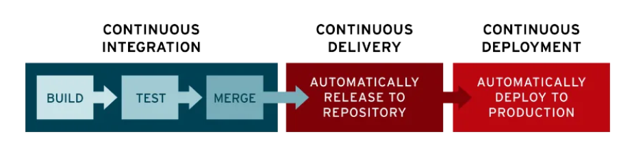

---
# Feel free to add content and custom Front Matter to this file.
# To modify the layout, see https://jekyllrb.com/docs/themes/#overriding-theme-defaults

layout: default
---


# Documentation CI/CD

## Introduction

La pratique de l'intégration continue (CI) consiste à intégrer automatiquement et régulièrement les modifications de code dans un référentiel de code source partagé. La distribution et/ou le déploiement continus (CD) désignent quant à eux un processus en deux volets qui englobe l'intégration, les tests et la distribution des modifications apportées au code. La distribution continue se limite au déploiement automatique dans les environnements de production, alors que le déploiement continu publie automatiquement les mises à jour dans ces environnements.




Durant ce projet, nous avons utilisé de Github action pour la réalisation du CI/CD.
2 worflows ont été créés pour ce projet:
- deploy.yaml
- phpunit-tests.yaml

## Explication du workflow PHPUNIT-TEST

- Copie du fichier :

```yml
name: Test Suite

on:
  pull_request:
    branches: [ '**' ]  # Cible toutes les branches
  workflow_call:        # Permet d'appeler ce workflow depuis d'autres workflows

jobs:
  tests:
    name: Run PHP Tests
    if: ${{ !startsWith(github.head_ref, 'docs/') }}
    runs-on: ubuntu-latest
    
    steps:
      - name: Checkout code
        uses: actions/checkout@v3
        
      - name: Setup PHP
        uses: shivammathur/setup-php@v2
        with:
          php-version: '8.2'
          extensions: mbstring, xml, intl, zip
          coverage: none
          
      - name: Install Dependencies
        run: composer install --no-interaction --prefer-dist
        
      - name: Execute PHPUnit tests
        run: php bin/phpunit
```

- 1ère partie :

```yml
name: Test Suite

on:
  pull_request:
    branches: [ '**' ]  # Cible toutes les branches
  workflow_call:        # Permet d'appeler ce workflow depuis d'autres workflows
```

Définition du nom du worflow et des déclencheurs (actions extérieurs qui permettent de déclencher le workflow).

> Les déclencheurs sont :
> - à chaque pull request.
> - lors d'un appel de ce dernier depuis un autre worflow.

- 2ème partie :

Définition des jobs du workflows (Tâches qui sont executés dans un runner) :

```yml
jobs:
  tests:
    name: Run PHP Tests
    if: ${{ !startsWith(github.head_ref, 'docs/') }}
    runs-on: ubuntu-latest
    
    steps:
      - name: Checkout code
        uses: actions/checkout@v3
        
      - name: Setup PHP
        uses: shivammathur/setup-php@v2
        with:
          php-version: '8.2'
          extensions: mbstring, xml, intl, zip
          coverage: none
          
      - name: Install Dependencies
        run: composer install --no-interaction --prefer-dist
        
      - name: Execute PHPUnit tests
        run: php bin/phpunit
```

Déclaration d'un nom qui sera affiché lors de l'execution du workflow :

```yml
name: Run PHP Tests
```

Définition d'une condition (facultatif) :

```yml
if: ${{ !startsWith(github.head_ref, 'docs/') }}
```

Ce workflow sera executé si le nom de la branche ne commence par docs/

Définition du runner utilisé :

```yml
runs-on: ubuntu-latest
```

Définition des steps :

```yml
- name: Checkout code
  uses: actions/checkout@v3
```
Récupération du code de github pour le transférer dans le runner.

```yml
- name: Setup PHP
  uses: shivammathur/setup-php@v2
  with:
    php-version: '8.2'
    extensions: mbstring, xml, intl, zip
    coverage: none
```

Utilisation d'une action qui install PHP 8.2 dans le runner avec ces extensions.

```yml
- name: Install Dependencies
  run: composer install --no-interaction --prefer-dist
```

Installation des dependances php.

- Définir les steps :
```yml
- name: Execute PHPUnit tests
  run: php bin/phpunit 
```

Execution des tests unitaires.

ENJOY THIS IS THE END OF THIS FIRST WORKFLOW :D


## Explication du workflow DEPLOY

- Copie du fichier :

```yml
name: Deploy
on:
  push:
    branches:
      - develop
 

jobs:
  test: 
    if: ${{ !contains(github.event.head_commit.message, 'Merge pull request') || !contains(github.event.head_commit.message, 'docs/') }}
    uses: ./.github/workflows/phpunit-tests.yml


  build:
    needs: test
    name: Build and push docker image to registry
    strategy:
      matrix:
        arch: [ amd64, arm64 ]
        include: 
          - arch: amd64
            runner: ubuntu-latest
            platform: linux/amd64
          - arch: arm64
            runner: ubuntu-24.04-arm
            platform: linux/arm64
    runs-on: ${{ matrix.runner }}
    steps:
      - uses: actions/checkout@v4
        with:
          fetch-depth: 0 # Shallow clones should be disabled for a better relevancy of analysis
      - name: Login to GHCR 
        uses: docker/login-action@v3
        with:
          registry: ghcr.io
          username: ${{ github.actor }}
          password: ${{ secrets.GITHUB_TOKEN }}
      - name: Build and push
        uses: docker/build-push-action@v6
        with:
          push: true
          platforms: ${{ matrix.platform }}
          tags: |
            ghcr.io/${{ github.repository_owner }}/hopper:dev-latest-${{ matrix.arch }}
            ghcr.io/${{ github.repository_owner }}/hopper:dev-v${{ github.run_number }}-${{ matrix.arch }}

  manifest:
    name: Create and push multi-arch manifest
    runs-on: ubuntu-latest
    needs: build
    steps:
      - name: Login to GHCR
        uses: docker/login-action@v3
        with:
          registry: ghcr.io
          username: ${{ github.actor }}
          password: ${{ secrets.GITHUB_TOKEN }}

      - name: pull the image localy
        run: | 
          docker pull --platform linux/amd64 ghcr.io/${{ github.repository_owner }}/hopper:dev-v${{ github.run_number }}-amd64
          docker pull --platform linux/arm64 ghcr.io/${{ github.repository_owner }}/hopper:dev-v${{ github.run_number }}-arm64
          docker pull --platform linux/amd64 ghcr.io/${{ github.repository_owner }}/hopper:dev-latest-amd64
          docker pull --platform linux/arm64 ghcr.io/${{ github.repository_owner }}/hopper:dev-latest-arm64
          
      - name: Create and push manifest 
        run: |
          docker manifest create ghcr.io/${{ github.repository_owner }}/hopper:dev-latest \
            --amend ghcr.io/${{ github.repository_owner }}/hopper:dev-latest-amd64 \
            --amend ghcr.io/${{ github.repository_owner }}/hopper:dev-latest-arm64
          
          docker manifest create ghcr.io/${{ github.repository_owner }}/hopper:dev-v${{ github.run_number }} \
            --amend ghcr.io/${{ github.repository_owner }}/hopper:dev-v${{ github.run_number }}-amd64 \
            --amend ghcr.io/${{ github.repository_owner }}/hopper:dev-v${{ github.run_number }}-arm64

          docker manifest push ghcr.io/${{ github.repository_owner }}/hopper:dev-latest
          docker manifest push ghcr.io/${{ github.repository_owner }}/hopper:dev-v${{ github.run_number }}


  update:
    name: Update the VPS with Ansible
    runs-on: ubuntu-latest
    needs: manifest
    steps:
    - uses: actions/checkout@v4
      with:
        fetch-depth: 0
    - name: add the private key 
      run: echo "${{ secrets.VPS_KEY }}" > private-key

    - name: change authorisation on the file private-key
      run: chmod 700 private-key

    - name: Create inventory ansible
      run:  echo "${{ secrets.INVENTORY }}" > inventory.ini

    - name: download the collection community.docker on Galaxy
      run: ansible-galaxy collection install community.docker

    - name: launch the playbook update VPS 
      run: ansible-playbook --key-file private-key -i inventory.ini ansible/updateSiteKapoot.yml
```

- 1ère partie :

```yml
name: Deploy
on:
  push:
    branches:
      - develop
```

Définition du nom du worflow et du déclencheur (push/merge sur la branche : develop).

On vérifie les conditions suivantes:

```yml
jobs:
  test: 
    if: ${{ !contains(github.event.head_commit.message, 'Merge pull request') || !contains(github.event.head_commit.message, 'docs/') }}
    uses: ./.github/workflows/phpunit-tests.yml
```
Si le message du commit ne contient pas "Merge pull request", ou si le message du commit ne contient pas de "docs/..." => Alors le workflow PHPUNIT sera executé.

- Etape de "build" :

```yml
  build:
    needs: test
    name: Build and push docker image to registry
    strategy:
      matrix:
        arch: [ amd64, arm64 ]
        include: 
          - arch: amd64
            runner: ubuntu-latest
            platform: linux/amd64
          - arch: arm64
            runner: ubuntu-24.04-arm
            platform: linux/arm64
    runs-on: ${{ matrix.runner }}
    steps:
      - uses: actions/checkout@v4
        with:
          fetch-depth: 0 # Shallow clones should be disabled for a better relevancy of analysis
      - name: Login to GHCR 
        uses: docker/login-action@v3
        with:
          registry: ghcr.io
          username: ${{ github.actor }}
          password: ${{ secrets.GITHUB_TOKEN }}
      - name: Build and push
        uses: docker/build-push-action@v6
        with:
          push: true
          platforms: ${{ matrix.platform }}
          tags: |
            ghcr.io/${{ github.repository_owner }}/hopper:dev-latest-${{ matrix.arch }}
            ghcr.io/${{ github.repository_owner }}/hopper:dev-v${{ github.run_number }}-${{ matrix.arch }}
```

Cette étape "build" permet de builder et pusher l'image docker dans le github registery container.

A l'aide de la strategy "matrix" (Attention ce n'est pas le film Matrix 😎... Morpheus sort de ce workflow...) , 2 types d'images seront construites en parallèle durant l'execution de cette étape (1x image pour les processeurs de type amd64 / 1x image pour les processeurs de type arm64).

- Etape de "manifest" :

```yml
  manifest:
    name: Create and push multi-arch manifest
    runs-on: ubuntu-latest
    needs: build
    steps:
      - name: Login to GHCR
        uses: docker/login-action@v3
        with:
          registry: ghcr.io
          username: ${{ github.actor }}
          password: ${{ secrets.GITHUB_TOKEN }}

      - name: pull the image localy
        run: | 
          docker pull --platform linux/amd64 ghcr.io/${{ github.repository_owner }}/hopper:dev-v${{ github.run_number }}-amd64
          docker pull --platform linux/arm64 ghcr.io/${{ github.repository_owner }}/hopper:dev-v${{ github.run_number }}-arm64
          docker pull --platform linux/amd64 ghcr.io/${{ github.repository_owner }}/hopper:dev-latest-amd64
          docker pull --platform linux/arm64 ghcr.io/${{ github.repository_owner }}/hopper:dev-latest-arm64
          
      - name: Create and push manifest 
        run: |
          docker manifest create ghcr.io/${{ github.repository_owner }}/hopper:dev-latest \
            --amend ghcr.io/${{ github.repository_owner }}/hopper:dev-latest-amd64 \
            --amend ghcr.io/${{ github.repository_owner }}/hopper:dev-latest-arm64
          
          docker manifest create ghcr.io/${{ github.repository_owner }}/hopper:dev-v${{ github.run_number }} \
            --amend ghcr.io/${{ github.repository_owner }}/hopper:dev-v${{ github.run_number }}-amd64 \
            --amend ghcr.io/${{ github.repository_owner }}/hopper:dev-v${{ github.run_number }}-arm64

          docker manifest push ghcr.io/${{ github.repository_owner }}/hopper:dev-latest
          docker manifest push ghcr.io/${{ github.repository_owner }}/hopper:dev-v${{ github.run_number }}
```

Cette étape de "manifest" permet de construire des manifests pour chaque type d'image.

Cela permet de recupérer de façon automatique la bonne image docker en fonction du type de sytème qui pull l'image docker. So fun !!! It's magic :D

- Etape de "update" :

```yml
  update:
    name: Update the VPS with Ansible
    runs-on: ubuntu-latest
    needs: manifest
    steps:
    - uses: actions/checkout@v4
      with:
        fetch-depth: 0
    - name: add the private key 
      run: echo "${{ secrets.VPS_KEY }}" > private-key

    - name: change authorisation on the file private-key
      run: chmod 700 private-key

    - name: Create inventory ansible
      run:  echo "${{ secrets.INVENTORY }}" > inventory.ini

    - name: download the collection community.docker on Galaxy
      run: ansible-galaxy collection install community.docker

    - name: launch the playbook update VPS 
      run: ansible-playbook --key-file private-key -i inventory.ini ansible/updateSiteKapoot.yml
```

Cette étape "update" permet de mettre à jour les VPS déclarés dans inventory.ini en utilisant Ansible. Incredible but true, all Vps declared will have an updated !!! :D

ENJOY THIS IS THE END OF THIS LAST WORKFLOW...
AND NOW YOU GET IT ;) I HOPE SO... :D

WRITTEN BY RP & AB - 30-04-2025

